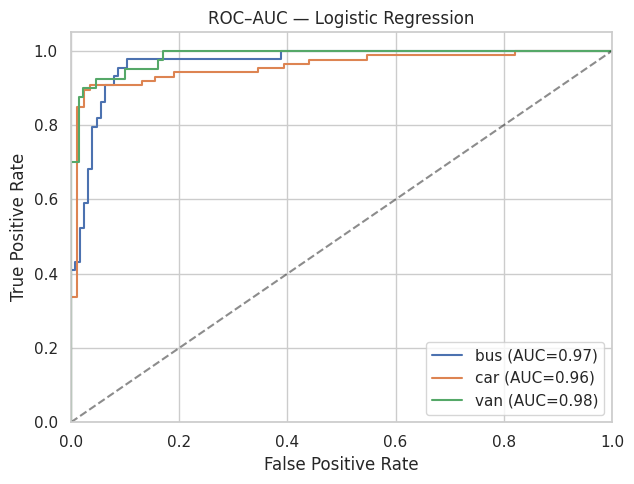
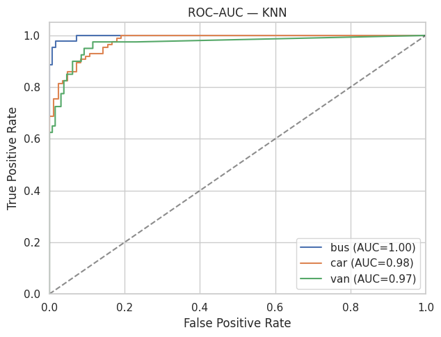
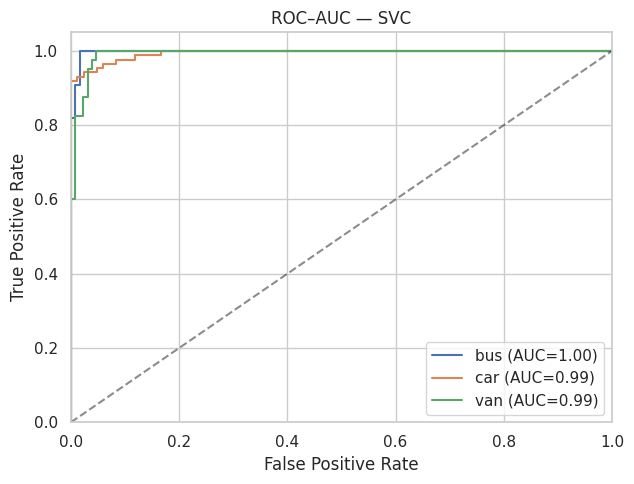
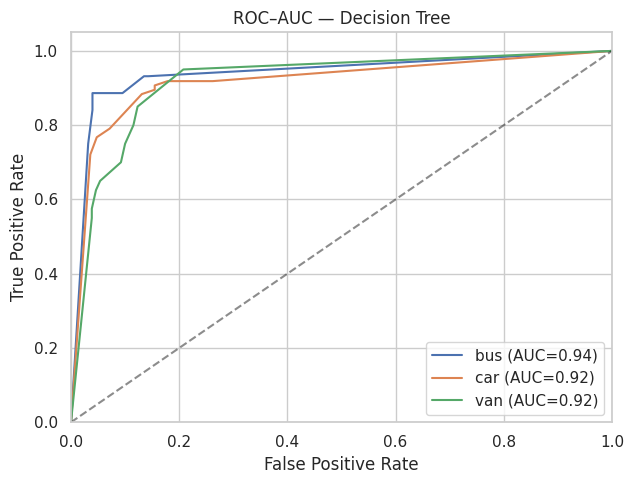
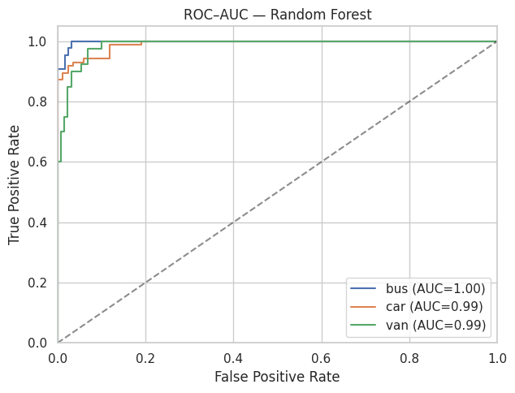
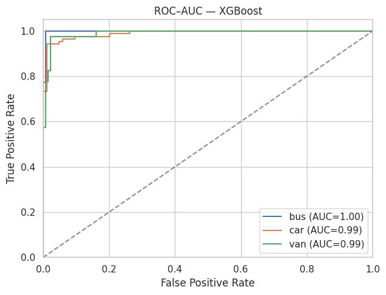

# 🚙 Car vs Van vs Bus Classification Project

# 📌 Project Title
Car vs Van vs Bus Classification using Machine Learning

# 🎯 Goal

To build and evaluate machine learning models that can accurately classify vehicles into Car, Van, or Bus categories based on structured features. Project evaluates baseline and tuned models, compares their performance, and visualizes ROC–AUC curves.

# 💼 Business Context

Accurate vehicle classification is important for transportation analytics, fleet management, traffic monitoring, and insurance risk assessment. Misclassification can lead to poor decision-making in resource allocation, tolling systems, and safety regulations.

# 🌍 Real-World Impact

A robust classification model can be applied in:

•	Smart city traffic systems for real-time vehicle detection

•	Insurance companies to validate claims with vehicle type checks

•	Logistics companies for fleet optimization

•	Autonomous vehicles for enhanced environmental awareness
 

# 📂 Project Workflow

## 🔹 Importing Libraries

All necessary libraries are imported for EDA, preprocessing, model training, and evaluation.

1. Importing the necessary libraries

	-import pandas as pd

	-import numpy as np

3. Visualization

	-import matplotlib.pyplot as plt

	-import seaborn as sns

	-import warnings

	-warnings.filterwarnings('ignore')

	-from IPython.display import display

	-pd.set_option('display.max_columns', None)

	-sns.set(style="whitegrid", rc={"figure.figsize": (8,5)})

5. Preprocessing & EDA

	-from scipy import stats

	-from sklearn.feature_selection import f_classif, mutual_info_classif

	-from statsmodels.stats.outliers_influence import variance_inflation_factor

	-from sklearn.decomposition import PCA

	-from sklearn.preprocessing import LabelEncoder, label_binarize

	-from sklearn.preprocessing import StandardScaler, MinMaxScaler

	-from itertools import cycle

	-from imblearn.over_sampling import SMOTE
	
	-from sklearn.model_selection import train_test_split

	-from sklearn.compose import ColumnTransformer

	-from sklearn.pipeline import Pipeline

	-from sklearn.impute import SimpleImputer

	-from sklearn.feature_selection import VarianceThreshold

7. Modeling

	-from sklearn.model_selection import cross_val_score, StratifiedKFold

	-from sklearn.model_selection import GridSearchCV
	
	-from sklearn.linear_model import LogisticRegression

	-from sklearn.multiclass import OneVsRestClassifier

	-from sklearn.neighbors import KNeighborsClassifier

	-from sklearn.svm import SVC

	-from sklearn.tree import DecisionTreeClassifier

	-from sklearn.ensemble import RandomForestClassifier

    -from xgboost import XGBClassifier

9. For evaluation
   
	-from sklearn.metrics import accuracy_score, precision_score, recall_score, f1_score, roc_auc_score, roc_curve, confusion_matrix, classification_report,log_loss, auc

## 🔹 Data Loading

Dataset loaded into Pandas dataframe for structured analysis. It has 846 entries and 19 columns.

**Features:** compactness,circularity,distance_circularity,radius_ratio,pr_axis_aspect_ratio,max_length_aspect_ratio,scatter_ratio,elongatedness,pr_axis_rectangularity,max_length_rectangularity,scaled_variance,scaled_variance_1, scaled_radius_of_gyration,scaled_radius_of_gyration_1,skewness_about,skewness_about_1,skewness_about_2,hollows_ratio,class. The dataset is imbalanced. Car is the majority (50.7%), followed by the Bus (25.8%) and the Van (23.5%).

**dataset link:** https://drive.google.com/file/d/11kXoTwaCsDHxCYSA-Cs8JugxY_kNUqjQ/view?usp=sharing

⸻

## 📊 Exploratory Data Analysis (EDA) 

	1.	Basic Information & Descriptives
	 •	Dataset shape, summary statistics, and feature overview.
	2.	Quick Structure, Types, Duplicates, Missing
	 •	Checked variable types, duplicate records, and missing values.
	3.	Data Health
	 •	Identified anomalies, inconsistent values, and checked integrity.
	4.	Target Balance
	 •	Verified whether classes (Car, Van, Bus) are balanced.
	5.	Univariate Distributions (Numeric)
	 •	Histograms and density plots for continuous variables.
	6.	Feature Separation Summary
	 •	Compared how features differ across Car, Van, and Bus.
	7.	Boxplots & Outliers
	 •	Detected outliers and extreme values.
	8.	Correlations & Redundancy
	 •	Pearson correlations and heatmaps to spot highly correlated features.
	9.	Feature ↔ Target Relationship (stats)
	 •	ANOVA F-test for linear separability
	 •	Mutual Information for non-linear separability
	10.	Class-wise Summary Table
	 •	Aggregated statistics by target class.
	11.	✅ Final Feature Ranking
	 •	Selected relevant features, dropped weak/constant/redundant ones.
	12.	Multicollinearity Check (VIF)
	 •	Ensured predictors are not excessively correlated.
	13.	Pairwise Plots for Top Signals
	 •	Scatter and pairplots for visual separation of classes.

⸻

## 🔧 Preprocessing

	1.	Split Data into Train/Test sets
	2.	Handle Missing Values
	3.	Remove Outliers
	4.	Drop Constant & Highly Correlated Columns
	5.	Scaling with StandardScaler
	6.	Encoding categorical target labels

⸻

## 🤖 Models Definition

We trained and tuned six different models:
	1.	Logistic Regression
	2.	K-Nearest Neighbors (KNN)
	3.	Support Vector Classifier (SVC)
	4.	Decision Tree
	5.	Random Forest
	6.	XGBoost

⸻

## 📈 Model Training & Evaluation

	•	Baseline Models: All models trained with default or simple settings.
	•	Hyperparameter Tuning: Used GridSearchCV with StratifiedKFold for fair comparison.
	•	Metrics Evaluated: Accuracy, Precision, Recall, F1 Score, Confusion Matrix, ROC–AUC Curves

## 📊 Model Performance

We trained and tuned six machine learning models. Below is the performance comparison **before and after hyperparameter tuning**:

| Model                | Accuracy (Base) | Accuracy (Tuned) | Precision (Tuned) | Recall (Tuned) | F1 (Tuned) |
|-----------------------|-----------------|------------------|-------------------|----------------|------------|
| **XGBoost**          | 0.947           | **0.953**        | 0.949             | 0.956          | **0.952**  |
| **SVC (RBF kernel)** | 0.941           | 0.941            | 0.927             | 0.952          | 0.938      |
| **Random Forest**    | 0.929           | 0.929            | 0.922             | 0.928          | 0.924      |
| **KNN**              | 0.877           | 0.900            | 0.893             | 0.904          | 0.898      |
| **Logistic Regression** | 0.877        | 0.894            | 0.877             | 0.894          | 0.885      |
| **Decision Tree**    | 0.847           | 0.841            | 0.838             | 0.814          | 0.823      |

---

## 🔍 Model Explanations

- **Logistic Regression** – Linear classifier using a sigmoid/logit function. Simple and interpretable, but struggles with non-linear data.  
- **KNN (K-Nearest Neighbors)** – Assigns a label based on the majority class among the *k* closest samples. Good for local patterns but sensitive to scaling and large datasets.  
- **SVC (Support Vector Classifier)** – Maximizes the margin between classes. With the RBF kernel, it captures non-linear patterns. Strong performance, but slower training on large data.  
- **Decision Tree** – Splits features recursively into a tree structure. Easy to interpret but prone to overfitting.  
- **Random Forest** – Ensemble of many decision trees using bagging and feature randomness. More stable and accurate than a single tree.  
- **XGBoost** – Gradient boosting algorithm that builds trees sequentially to correct previous errors. State-of-the-art on structured data, with strong regularization against overfitting.  

---

## 📈 ROC–AUC Curves

The following ROC–AUC plots show the trade-off between True Positive Rate (TPR) and False Positive Rate (FPR) for each classifier:  

| Logistic Regression | KNN | SVC |
|---------------------|-----|-----|
|  |  |  |

| Decision Tree | Random Forest | XGBoost |
|---------------|---------------|---------|
|  |  |  |
 

---

# 🏆 Conclusion

- **Best overall performer:** **XGBoost** (Accuracy = 95.3%, F1 = 0.95, AUC ~ 0.99)  
- **Runner-up:** **SVC (RBF)** with strong recall and AUC.  
- **Random Forest** remains competitive with stable performance.  
- **KNN & Logistic Regression** work as good baselines but lag in complex boundaries.  
- **Decision Tree** is interpretable but prone to overfitting.  

👉 **Final recommendation: Use XGBoost for production deployment.**

# Usage Instruction

	•	Click the Colab badge (add this at the top of your README):

